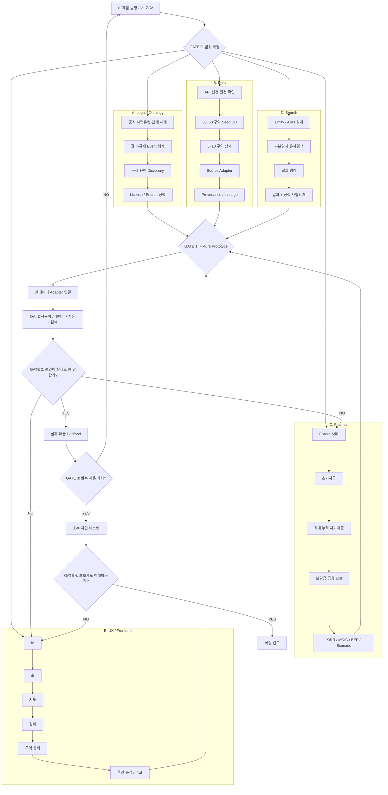

# 재개발 지도·투자분석 프로젝트 — 세션 인계 정본 v0.2
작성일: 2026-09-28 (Asia/Seoul)

> 목적: 다음 ChatGPT / Claude / Codex 세션이 별도 재해석 없이 바로 이어서 작업하도록 하는 실행용 인계문서.
> 우선순위: 이 문서의 `확정사항 / 금지사항 / CURRENT / NEXT`가 이전 대화 요약보다 우선한다.

---

## 0. 프로젝트 한 줄 정의

**서울 재개발·재건축 사업구역을 지도와 검색으로 쉽게 찾고, 공식 사업단계·법적/권리 정보를 정확히 유지하면서, 사용자가 발견한 개별 물건의 초기자금·최대 누적 자기자금·총비용·프리미엄·분담금·주변가치·예상 손익·엑싯 시나리오를 쉽게 비교하는 투자분석 도구.**

장기적으로는 상용 서비스 가능성을 열어두지만, 현재 V1은 **본인 + 소수 지인용 검증 프로토타입**이다.

---

## 1. 지금까지 진행된 단계

```text
[완료] 시장조사 — 재개발닷컴
   ↓
[완료] 경쟁제품 역분해
   ↓
[완료] 초기 탐색 — 데이터/기술/차별화
   ↓
[완료] 제품·DB·계산 구조 초안
   ↓
[완료] 외부 감사(Claude) + 스코프 축소
   ↓
[완료] 법적 용어 / 검색 / 홈 / 라이선스 원칙 보정
   ↓
[NEXT] V1 실행 계약 확정 + 5개 워크스트림 병렬 착수
   ↓
[NEXT] Fixture Prototype
   ↓
[NEXT] 실제 데이터 Adapter 연결
   ↓
[NEXT] 본인 Dogfood
   ↓
[NEXT] 소수 지인 사용성 검증
```

---

# 2. 절대 바꾸면 안 되는 제품 원칙

## 2.1 법적·공식 용어가 항상 정본

재개발/재건축은 법적 용어와 권리관계가 제품 신뢰의 핵심이다.

- `조합설립인가`, `사업시행계획인가`, `관리처분계획인가`, `정비구역지정` 등 **공식 사업단계 명칭을 임의로 쉬운 말로 대체하지 않는다.**
- 재개발닷컴이나 공식 행정자료에 존재하는 사업유형·단계·권리 용어도 임의 번역/축약하지 않는다.
- 초보자용 표현은 **보조 라벨 / 설명문 / 툴팁 / 별도 안내 레이어**로만 제공한다.
- 사업유형마다 절차가 다르므로 하나의 임의 5단계 사다리로 덮지 않는다.
- 신속통합기획 등 정책·행정상 단계와 도시정비법상 법정 인가 단계는 성격을 구분해 저장한다.
- `권리산정기준일`, 거래규제, 조합원 지위/분양자격 관련 사실 등은 사업 진행단계와 별도 축으로 관리한다.
- 필요한 사실이 부족할 때 `입주권 PASS`, `분양자격 확정` 같은 자동 법률결론을 내리지 않는다. 기본 상태는 `확인 필요`.

### UI 예시

```text
조합설립인가
2026.04.17

쉽게 보기
토지등소유자 동의를 거쳐 조합 설립을 관할 행정청이 인가한 단계입니다.

[법적 의미] [근거 원문] [다음 절차]
```

공식 명칭이 위, 쉬운 설명이 아래다.

---

## 2.2 접근성은 정보를 삭제하는 것이 아니라 '읽는 순서'를 바꾸는 것

최상위 모토:

> **누구나 대충 쓱쓱 볼 수 있을 만큼 쉽고, 필요한 사용자는 재개발닷컴 수준 이상으로 깊게 내려갈 수 있어야 한다.**

### 한 데이터, 세 깊이

1. **쓱 보기** — 구역명, 공식 사업단계, 핵심 날짜, 처음 필요한 돈, 최대 필요자금, 가장 큰 미확인사항
2. **비교·이해** — 가격 구성, 자금 시간표, 주변 거래, 시나리오, 사업 이력
3. **전문·원문** — 정확한 법적 용어, 고시/공고 원문, 필지/건물, 산식, 근거·기준일·출처

---

## 2.3 지도와 검색은 동급의 핵심 진입점

사용자의 의도는 둘로 나뉜다.

```text
탐색형: "어디에 재개발이 있지?" → 지도
목적형: "상도15 / 하안주공10단지 / 이 주소를 보고 싶다" → 검색
```

따라서 홈 / 지도 / 검색은 모두 핵심이다.

---

## 2.4 개별 물건 분석이 제품의 본체

핵심 질문:

- 무엇을 사는가?
- 지금 얼마가 필요한가?
- 나중에 얼마가 더 필요한가?
- 진행 중 자기자금이 최대 얼마까지 묶이는가?
- 총비용은 얼마인가?
- 프리미엄/분담금은 어떻게 구성되는가?
- 주변 신축/실거래와 비교하면 어떤가?
- 어떤 가정에서 얼마가 남는가?
- 엑싯 시기와 조건은 무엇인가?
- 아직 확인되지 않은 법적·권리·금융 사실은 무엇인가?

`초투` 한 숫자만 크게 보여주는 서비스를 만들지 않는다.

---

# 3. 경쟁제품(재개발닷컴)에서 반드시 baseline으로 가져갈 UX

## 3.1 검색

검색 대상:
- 구역명
- 단지명
- 주소/지번
- 지하철역
- 별칭/옛 명칭/후보지 명칭

요구사항:
- 전체 이름을 정확히 입력하지 않아도 결과가 나와야 한다.
- Prefix / 부분일치 / Alias / 오타·유사 문자열 검색을 지원한다.
- 검색결과 목록 자체에 **사업유형 + 공식 현재 사업단계**를 표시한다.

예:

```text
하안주공

하안주공1·2단지
재건축 · 추진위승인
광명시 하안동

하안주공8단지
재건축 · 정비구역지정(공람)
광명시 하안동
```

V1 검색 후보:
- PostgreSQL `pg_trgm`
- 한글 normalization
- Alias table
- Exact > alias exact > prefix > substring > fuzzy 순으로 랭킹

## 3.2 사업단계 상시 노출

사업단계는 상세페이지 안쪽 정보가 아니라 **구역명과 붙어 다니는 핵심 정보**로 취급한다.

검색결과, 지도 카드, 구역 상단, 최근 본 곳, 관심 구역 등에 현재 공식 사업단계를 함께 노출한다.

## 3.3 상세 탭 구조

정보과밀을 막기 위해 재개발닷컴처럼 탭/카드/펼치기를 적극 사용한다.

후보:
- 개요
- 진행현황
- 실거래
- 물건
- 권리·규제
- 자료/원문
- 주변 비교
- 생활/입지

실제 V1에서는 데이터가 있는 탭만 노출한다.

## 3.4 사용자 수정/추가 제보

상용/확장 단계에서 `정보 수정 요청 / 자료 추가 요청` 진입점을 고려한다.
변동이 잦은 데이터 서비스에서 사용자 제보를 QA 센서로 활용한다.

---

# 4. 메인 IA / 홈 방향

현재 제안 Primary Navigation:

**홈 / 지도 / 검색 / 비교 / 내 정보**

V1에는 커뮤니티를 만들지 않는다. 커뮤니티가 실제로 생기기 전 Primary Navigation에 빈 탭을 만들지 않는다.

## 홈의 역할

홈은 "지도 축소판"이 아니다.

- 이미 아는 구역/단지/주소를 바로 검색
- 최근 본 구역
- 분석 중인 내 물건
- 관심 구역
- 오늘 바뀐 구역/사업단계
- 필요 시 초보자용 진입

예시:

```text
┌──────────────────────────────┐
│ 구역·단지·주소·역 검색       │
└──────────────────────────────┘

최근 본 곳
상도15 | 하안주공8 | 청파2

내가 분석 중인 물건
상도15 / OO빌라
처음 3.8억 · 최대 7.6억

최근 변경
조합설립인가   OO구역
정비구역지정   XX구역

[홈] [지도] [검색] [비교] [내 정보]
```

---

# 5. V1 핵심 화면 — 5개

## 1) 홈
검색 중심. 최근 본 곳/내 물건/최근 변경.

## 2) 지도
- 공식/확인된 구역 경계
- 구역명
- 사업유형
- 공식 현재 사업단계
- 클릭 시 요약 카드

경계 정확도/성격:
- 공식 확인 경계
- 후보지/행정 범위
- 분석용 추정 범위
를 구분한다.

## 3) 검색
- 구역/단지/주소/역
- 부분일치/유사검색
- 결과에 사업유형·공식 현재단계 노출

## 4) 구역 상세
상단:
- 구역명
- 사업유형
- 공식 사업단계 + 날짜
- 최근 확인일
- 법적/권리 핵심 표시

하단:
- 사업 이력
- 실거래
- 주변 신축
- 권리·규제
- 자료/원문
- 사용자가 추가한 물건

## 5) 물건 분석 + 비교
첫 화면의 핵심 숫자는 최대 5~6개로 제한:

- 지금 필요한 내 돈
- 앞으로 추가로 필요한 돈
- 최대 누적 자기자금
- 전체 매입·사업비용
- 기준 시나리오 세전 손익
- 가장 중요한 미확인사항

더 내려가면:
- 프리미엄
- 기납부/잔여 분담금
- 대지지분
- 공시가격
- 주변 실거래
- 주변 신축
- Cash Flow
- XIRR / MOIC
- 손익분기 Exit Price
- 분담금/금리/기간/매도가 민감도

---

# 6. 투자 계산 엔진 — 유지할 핵심 규칙

반드시 구분:
1. 초기 자기자금
2. 전체 매입·사업비용
3. 최대 누적 자기자금 투입액
4. 날짜별 현금흐름

### 금지
- 보증금/대출을 경제적 비용에서 빼서 수익처럼 만들지 않는다.
- 프리미엄을 매매가에 포함하고 다시 비용에 더하지 않는다.
- 기납부 분담금을 매매가와 미래 분담금 양쪽에 중복산입하지 않는다.
- 모르는 값을 0으로 저장하지 않는다.
- 실제 날짜가 없는데 XIRR인 것처럼 표시하지 않는다.
- IRR 하나로 투자 매력을 판단하지 않는다.

### 핵심 결과
- 세전 손익
- 최대 자기자금
- MOIC
- XIRR(유효할 때)
- 손익분기 매도가
- 보유기간
- 자금 부족 시점
- 시나리오 민감도

---

# 7. 데이터 구조 — 공식 사실과 설명/추정을 분리

주요 Entity:

```text
PROJECT
STAGE_FRAMEWORK
PROJECT_STAGE_EVENT
RIGHTS_REGULATION_EVENT

BOUNDARY_VERSION
PARCEL
BUILDING
UNIT

TRANSACTION
LISTING_OBSERVATION
INVESTMENT_CASE
CASHFLOW_SCENARIO

SOURCE
SOURCE_LICENSE
FACT_ASSERTION
SOURCE_LINEAGE
```

## 핵심 원칙
- 공식 사업단계 원문/코드/출처기관/효력일을 보존.
- 경계 변경 시 과거 버전을 삭제하지 않는다.
- 공개 데이터가 호실을 확정하지 못하면 호실을 추정하지 않는다.
- `공식 확인 / 자료 확인 / 추정 / 사용자 가정 / 확인 필요` 상태를 필드별로 구분한다.
- AI는 중요 법률/권리 사실을 자동 확정하지 않는다.

---

# 8. 데이터 라이선스 / 상용화 준비 라벨

지금은 비공개 V1이어도 **라벨은 처음부터 저장한다.**

`SOURCE_LICENSE` 최소 필드:

```text
source_id
license_name
commercial_use
redistribution
derivative_use
attribution_required
ai_processing
reviewed_at
review_note
```

상태:
- GREEN = 상업적 사용 확인
- YELLOW = 조건/출처표시/계약 등 추가 확인 필요
- RED = 현재 상업판 기본 차단
- WHITE = 미검토

## Source Lineage
여러 데이터가 합쳐진 파생지표는 upstream source를 모두 추적한다.

```text
파생지표
 ├─ source A [GREEN]
 ├─ source B [GREEN]
 └─ source C [RED]

commercial_readiness = RED
```

기본 규칙은 **가장 제한적인 원천의 상태를 상속**한다.
향후 상용화 Gate에서 RED/YELLOW를 일괄 감사한다.

---

# 9. 데이터 범위 — 넓고 얕게 + 좁고 깊게

## 지도용
서울 **30~50개 구역**
- 이름
- 경계
- 사업유형
- 공식 현재 사업단계
- 단계 날짜

## 상세 검증용
그중 **5~10개 구역**
- 사업 이력
- 고시/공고
- 실거래
- 건물/필지
- 주변 아파트
- 권리/규제

## 투자분석용
**20~30개 실제/fixture 물건**
- 계산 입력
- 현금흐름
- 시나리오
- 비교

---

# 10. V1에서 하지 않는 것

현재 V1 범위 밖:
- 전국 서비스
- 전국 매물망
- 비공식 네이버 매물 크롤링
- 결제
- 중개사 계약 시스템
- 경매
- 소유주 인증
- 커뮤니티
- 앱
- 푸시 알림
- 자동 투자 추천
- 복잡한 AI 감정가
- 자동 법률판단
- 완전 자동 고시 수집 파이프라인

---

# 11. 회사식 병렬 워크스트림



---

# 12. 역할 분해

| 워크스트림 | 할 일 | 최초 산출물 |
|---|---|---|
| Product/PM | 범위, 우선순위, Gate | V1 Contract |
| Legal/Ontology | 공식 사업단계, 권리/규제, 용어 | Stage & Rights Dictionary |
| Data | API, 경계, 거래, 건물, 출처 | Seed DB |
| Search | 명칭/별칭/주소/유사검색 | Search Index |
| Finance | 현금흐름, 초투, 최대자금, Exit | Calculation Engine |
| UX/UI | 홈/지도/검색/상세/비교 | Fixture Prototype |
| QA | 법적용어·정합성·계산 검증 | Validation Suite |
| Research | 본인/지인 사용성 | Test Report |

---

# 13. Gate 정의

## GATE 0 — V1 계약
- 법적 용어 원칙 확정
- V1 화면/데이터 범위 확정
- 하지 않을 것 확정

## GATE 1 — Fixture Prototype
- 홈/지도/검색/구역/분석·비교가 fixture로 한 바퀴 동작
- 계산 엔진 테스트 통과
- 검색에 사업단계 상시 노출
- 초보 설명이 공식 용어를 덮지 않음

## GATE 2 — 실제 데이터 통합
- 최소 5개 구역 실제 데이터
- 출처/기준일/라이선스 라벨 확인
- 실거래/단계/경계 연결 검증

## GATE 3 — 본인 Dogfood
- 실제 매물 검토 시 기존 엑셀/여러 사이트보다 편한가?
- 자금 시간표가 실질적으로 도움이 되는가?
- 3초 카드가 실제로 읽히는가?

## GATE 4 — 지인 테스트
- 초보자가 공식 단계명을 보고도 의미를 이해하는가?
- 처음 필요한 돈 / 최대 필요자금 / 미확인사항을 설명할 수 있는가?

---

# 14. CURRENT

현재 상태(2026-09-28):

- **GATE 0 완료** — `V1_PROTOTYPE_CONTRACT.md`를 확정함.
- 정본 원칙 유지:
  - 공식 사업단계·법적/권리 용어가 canonical
  - 쉬운 설명은 보조 레이어
  - 사업단계와 권리·규제 Event 분리
  - unknown은 0/PASS가 아니라 `NEEDS_REVIEW`
- Legal/Ontology, Data, Finance, Search, UX 5개 워크스트림 1차 착수 완료.
- `src/prototype.mjs`
  - 서울형 synthetic project fixture 10개
  - investment case fixture 20개
  - exact / alias exact / prefix / substring / trigram fuzzy 검색
  - 초기 자기자금 / 향후 추가자금 / 최대 누적 자기자금 / 총 경제적 비용 / 세전손익 / MOIC / XIRR / 손익분기 매도가 계산
  - 기납부 분담금 중복산입 방지
  - 보증금·대출과 경제적 비용 분리
  - 핵심 unknown fail-closed
- `db/schema.sql`
  - PostgreSQL `pg_trgm`
  - project / alias / stage event / rights-regulation event / boundary version
  - source / source_license / fact_assertion / source_lineage
  - investment_case
- `data/source_registry.json`
  - 국가법령정보센터: YELLOW
  - 서울 정비사업 정보몽땅: YELLOW
  - 국토부 연립다세대 매매 실거래가: GREEN
  - 국토부 Building HUB 건축물대장: GREEN
  - 서울시·자치구 고시/공고: WHITE
- `web/index.html`
  - 홈 / 지도 / 검색 / 구역 상세 / 물건 분석·비교 5화면 fixture prototype
  - 지도는 공식 경계가 아닌 fixture 좌표도임을 명시
  - 권리/규제는 원문 확인 전 `NEEDS_REVIEW`
- `.github/workflows/test.yml`로 main push마다 `npm test`를 검증.

아직 완료되지 않은 것:
- 실제 공공데이터 서비스키/API 연결
- 서울 30~50개 실제 구역 seed
- 5~10개 실제 구역 deep validation
- 공식 경계 adapter
- 고시/공고 원문 assertion/lineage
- 실제 매물 dogfood
- 소수 지인 사용성 테스트

---

# 15. NEXT

## A. 사용자만 할 수 있는 외부 액션

1. 공공데이터포털에서 실제 호출용 서비스키 준비
   - 국토교통부 연립다세대 매매 실거래가
   - 국토교통부 Building HUB 건축물대장정보
2. 서울 정비사업 정보몽땅의 대량수집/API/상업적 재사용 조건을 약관 또는 담당부서 기준으로 확인
3. 공식 경계 데이터를 어떤 외부 원천(VWorld/서울 GIS/공식 고시 첨부 등)으로 받을지 결정 후, 필요한 경우 해당 API 키 신청

비밀키는 저장소에 커밋하지 않는다. 향후 환경변수/Secret으로 주입한다.

## B. 다음 구현 순서

외부 키를 기다리지 않고 할 수 있는 범위는 계속 fixture/manual seed로 진행한다.

1. Source Adapter 인터페이스 고정
2. 실제 서울 구역 30~50개 seed 목록 작성
3. 그중 5~10개 deep validation 대상 선정
4. 고시/공고 → FACT_ASSERTION → PROJECT_STAGE_EVENT / RIGHTS_REGULATION_EVENT 연결
5. 실거래 / 건축물대장 adapter 연결
6. 공식 경계 adapter 연결
7. fixture prototype을 실제 데이터로 치환
8. GATE 2 정합성 QA
9. 실제 매물 dogfood → GATE 3

---

# 16. 다음 세션 첫 지시문

> `README.md`, `REDEVELOPMENT_HANDOFF_v0.2_20260928.md`, `V1_PROTOTYPE_CONTRACT.md`를 정본으로 읽어. GATE 0은 이미 확정됐고 5개 워크스트림의 fixture 구현도 시작되어 있으므로 계약을 다시 설계하지 마. `src/prototype.mjs`, `tests/prototype.test.mjs`, `db/schema.sql`, `data/source_registry.json`, `docs/WORKSTREAMS_V1.md`, `web/index.html`을 실제로 읽고 CURRENT/NEXT에서 이어가. 공식 사업단계·법적/권리 용어는 그대로 유지하고 쉬운 표현은 보조 레이어에만 둔다. 실제 API 키가 없어도 manual seed로 진행하되, 실제 사실로 표시하는 값에는 source assertion과 provenance가 반드시 있어야 한다.
